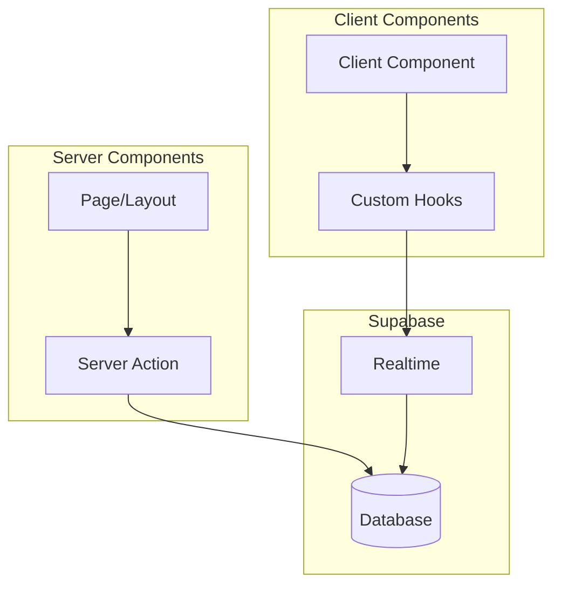

# ディレクトリ構造

## 目的

Katorin2のディレクトリ構造とコンポーネント設計を定義する。本ドキュメントはアーキテクチャ設計のSSoTである。

## 背景

Next.js 16 (App Router) + TypeScript を採用し、next-intlによる多言語対応を実装している。
コンポーネントは機能ごとに分類し、再利用性と保守性を重視する。

## 主要ディレクトリ

| ディレクトリ | 用途 |
|-------------|------|
| src/app/ | Next.js App Router（ページ、レイアウト、API Routes） |
| src/components/ | UIコンポーネント |
| src/lib/ | ユーティリティ、Supabaseクライアント、ビジネスロジック |
| src/hooks/ | グローバルカスタムフック |
| src/types/ | グローバル型定義 |
| src/i18n/ | 国際化設定 |
| supabase/ | マイグレーション、シードデータ |

## App Router構造

### ルーティング

i18n対応のため、`[locale]` セグメントを最上位に配置。Route Groupsでレイアウトを分離している。

| Route Group | 用途 | レイアウト |
|-------------|------|-----------|
| (main) | メインアプリケーション | ヘッダー + サイドバー |
| (auth) | 認証ページ | シンプルなセンタリング |

### 言語対応

| URL | 言語 |
|-----|------|
| /en/tournaments | 英語 |
| /ja/tournaments | 日本語 |

### 主要ルート

| パス | 説明 |
|------|------|
| / | トップページ |
| /tournaments | 大会一覧 |
| /tournaments/new | 大会作成 |
| /tournaments/[id] | 大会詳細 |
| /tournaments/[id]/manage | 大会管理（主催者向け） |
| /tournaments/[id]/bracket | トーナメント表 |
| /series | シリーズ一覧 |
| /teams | チーム一覧 |
| /my | マイページ |

## コンポーネント設計

### 分類

| 分類 | ディレクトリ | 説明 |
|------|-------------|------|
| UIコンポーネント | components/ui/ | shadcn/ui ベースの汎用コンポーネント |
| レイアウト | components/layout/ | ヘッダー、フッター、サイドバー等 |
| 大会機能 | components/tournament/ | 大会関連コンポーネント |
| シリーズ機能 | components/series/ | シリーズ関連コンポーネント |
| チーム機能 | components/team/ | チーム関連コンポーネント |

### 命名規則

| 種類 | 命名 | 例 |
|------|------|-----|
| コンポーネント | PascalCase | TournamentCard.tsx |
| フック | camelCase (use prefix) | useRealtimeMatches.ts |
| ユーティリティ | camelCase | bracketUtils.ts |
| 型定義 | PascalCase | Tournament.ts |

## データフロー

Server ComponentsとClient Componentsを適切に使い分け、Supabaseとのデータ連携を行う。

### Server Components（デフォルト）

| 用途 | 説明 |
|------|------|
| データ取得 | Server Actionsでデータ取得 |
| SEO | メタデータ生成 |
| 初期表示 | 高速な初期レンダリング |

### Client Components（'use client' 指定）

| 用途 | 説明 |
|------|------|
| インタラクション | フォーム、ボタンクリック |
| リアルタイム | Supabase Realtime連携 |
| 状態管理 | useState, useReducer |

## 状態管理

### サーバーサイド

Server ComponentsでSupabaseからデータを取得し、クライアントに渡す。Server Actionsでデータ更新を行う。

### クライアントサイド

| 用途 | 手法 |
|------|------|
| ローカル状態 | React useState/useReducer |
| リアルタイム更新 | Supabase Realtime + カスタムフック |
| フォーム | React Hook Form |

グローバル状態管理ライブラリ（Redux, Zustand等）は現在不使用。必要に応じて検討する。

## 関連ドキュメント

- @01-introduction/tech-stack.md - 技術スタック
- @04-data/database-design.md - データベース設計
- @06-interfaces/screen-design.md - 画面設計
- @appendix/glossary.md - 用語集
