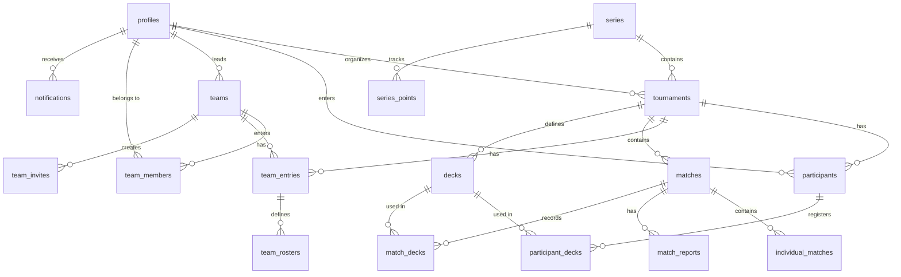
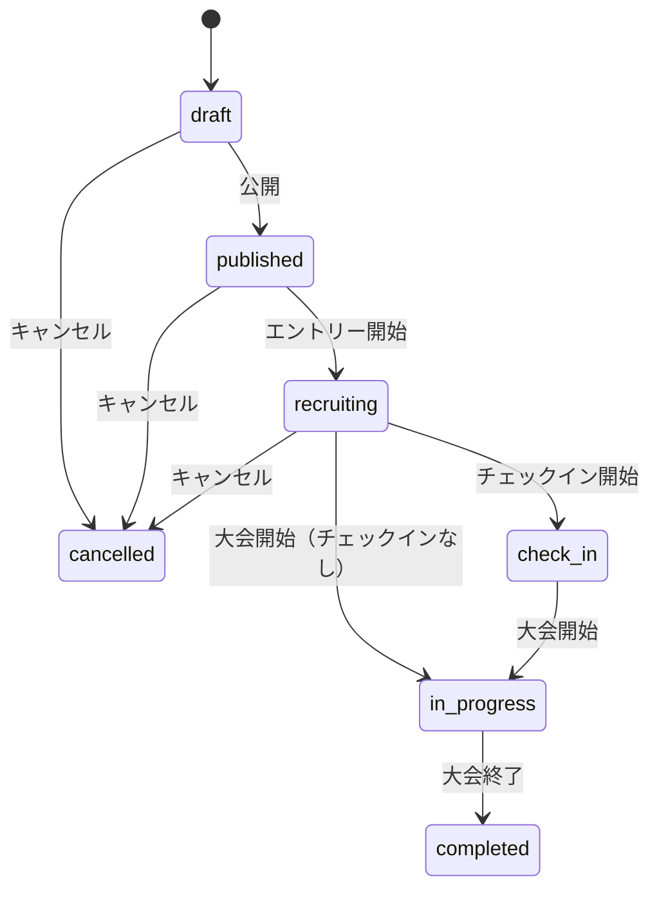
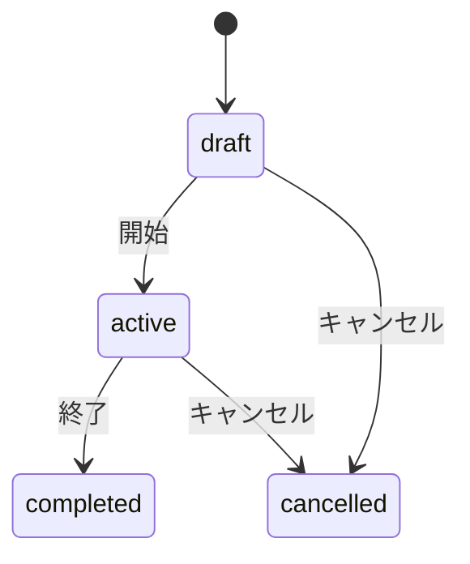

# データベース設計

## 目的

Katorin2のデータベース設計を定義する。本ドキュメントはデータモデルのSSoTである。

## 背景

遊戯王マスターデュエルのオンライントーナメントを管理するため、以下のデータモデルが必要となる。

| 要件 | 説明 |
|------|------|
| DBMS | PostgreSQL（Supabase） |
| 認証 | Supabase Auth連携 |
| リアルタイム | Supabase Realtime対応 |
| セキュリティ | Row Level Security (RLS) |

## Phase区分

| Phase | 状態 | 含まれる機能 |
|-------|------|-------------|
| Phase 1 | 実装済み | 基本的な大会運営（シングルエリミ、個人戦、主催者による結果入力） |
| Phase 2 | 未実装 | チェックイン、デッキ登録、カスタムフィールド、チーム招待通知 |

### Phase 2として予定している項目

| カテゴリ | 項目 |
|---------|------|
| ENUM拡張 | tournament_status に `check_in` ステータス |
| ENUM拡張 | notification_type に `check_in_reminder`, `team_invite` |
| tournaments拡張 | `check_in_enabled`, `check_in_start_at`, `check_in_deadline`, `deck_registration_mode`, `swiss_rounds` |
| 新テーブル | `custom_fields`, `custom_answers`（現在は`tournaments.custom_fields` JSONBで簡易実装） |

## ER図

## エンティティ一覧

### コアエンティティ

| テーブル | 説明 | 主なリレーション |
|---------|------|-----------------|
| profiles | ユーザープロフィール | auth.usersと1:1連携 |
| series | シリーズ/リーグ | tournamentsを複数持つ |
| tournaments | 大会 | 参加者、試合、デッキを持つ |

### 参加管理

| テーブル | 説明 | 用途 |
|---------|------|------|
| participants | 個人戦参加者 | 大会への個人エントリー |
| teams | チーム | チーム戦用の永続的なチーム |
| team_members | チームメンバー | チームとユーザーの関連 |
| team_invites | チーム招待 | 招待リンク管理 |
| team_entries | チーム戦エントリー | 大会へのチームエントリー |
| team_rosters | 出場メンバー | チーム戦での出場順 |

### 対戦管理

| テーブル | 説明 | 用途 |
|---------|------|------|
| matches | 対戦 | トーナメントブラケットの各試合 |
| individual_matches | 個人戦（チーム戦内） | チーム戦内の個別対戦 |
| match_reports | 結果報告 | 参加者からの結果報告 |

### デッキ管理

| テーブル | 説明 | 用途 |
|---------|------|------|
| decks | デッキマスタ | 大会/シリーズで使用可能なデッキ定義 |
| participant_decks | エントリー時デッキ | エントリー時のデッキ登録 |
| match_decks | 対戦時デッキ | 試合で使用したデッキ記録 |

### その他

| テーブル | 説明 | 用途 |
|---------|------|------|
| series_points | シリーズポイント | シリーズ内の成績・ポイント |
| notifications | 通知 | ユーザーへの通知 |
| custom_fields | カスタム入力項目 | Phase 2（大会独自の入力項目） |
| custom_answers | カスタム項目回答 | Phase 2（参加者の回答） |

## 主要エンティティ詳細

### profiles（ユーザープロフィール）

Supabase Auth の `auth.users` と連携するプロフィールテーブル。

| カラム | 型 | 説明 |
|--------|-----|------|
| id | UUID (PK) | auth.usersへの外部キー |
| display_name | VARCHAR(50) | 表示名 |
| avatar_url | TEXT | アバター画像URL |
| discord_id | VARCHAR(30) | Discord ID |
| bio | TEXT | 自己紹介 |
| created_at | TIMESTAMPTZ | 作成日時 |
| updated_at | TIMESTAMPTZ | 更新日時 |

### series（シリーズ/リーグ）

| カラム | 型 | 説明 |
|--------|-----|------|
| id | UUID (PK) | シリーズID |
| name | VARCHAR(100) | シリーズ名 |
| description | TEXT | 説明 |
| organizer_id | UUID (FK) | 主催者 |
| entry_type | ENUM | 参加形式（individual/team） |
| point_system | ENUM | ポイント計算方式（ranking/wins） |
| point_config | JSONB | ポイント設定 |
| start_date | DATE | 開始日 |
| end_date | DATE | 終了日 |
| status | ENUM | ステータス |
| created_at | TIMESTAMPTZ | 作成日時 |
| updated_at | TIMESTAMPTZ | 更新日時 |

### tournaments（大会）

| カラム | 型 | 説明 |
|--------|-----|------|
| id | UUID (PK) | 大会ID |
| title | VARCHAR(100) | タイトル |
| description | TEXT | 説明 |
| cover_image_url | TEXT | カバー画像 |
| organizer_id | UUID (FK) | 主催者 |
| series_id | UUID (FK) | 所属シリーズ |
| visibility | ENUM | 公開設定（public/unlisted/private） |
| status | ENUM | ステータス |
| entry_type | ENUM | 参加形式 |
| team_battle_format | ENUM | チーム戦形式（knockout/point） |
| team_size_min | SMALLINT | 最小チームサイズ |
| team_size_max | SMALLINT | 最大チームサイズ |
| team_creation_mode | ENUM | チーム作成モード（user/organizer） |
| tournament_format | ENUM | トーナメント形式 |
| match_format | ENUM | 対戦形式（bo1/bo3/bo5） |
| max_participants | SMALLINT | 参加上限 |
| swiss_rounds | SMALLINT | スイスドローのラウンド数 |
| entry_start_at | TIMESTAMPTZ | エントリー開始 |
| entry_deadline | TIMESTAMPTZ | エントリー締切 |
| check_in_enabled | BOOLEAN | チェックイン有効 |
| check_in_start_at | TIMESTAMPTZ | チェックイン開始 |
| check_in_deadline | TIMESTAMPTZ | チェックイン締切 |
| result_report_mode | ENUM | 結果報告モード |
| deck_registration_mode | ENUM | デッキ登録モード |
| start_at | TIMESTAMPTZ | 開催日時 |
| current_round | SMALLINT | 現在のラウンド |
| created_at | TIMESTAMPTZ | 作成日時 |
| updated_at | TIMESTAMPTZ | 更新日時 |

### matches（対戦）

| カラム | 型 | 説明 |
|--------|-----|------|
| id | UUID (PK) | 試合ID |
| tournament_id | UUID (FK) | 大会 |
| round | SMALLINT | ラウンド番号 |
| match_number | SMALLINT | 試合番号 |
| bracket_side | ENUM | ブラケット位置（winners/losers/grand_final） |
| player1_id | UUID (FK) | プレイヤー1 |
| player2_id | UUID (FK) | プレイヤー2 |
| team1_id | UUID (FK) | チーム1 |
| team2_id | UUID (FK) | チーム2 |
| player1_score | SMALLINT | プレイヤー1スコア |
| player2_score | SMALLINT | プレイヤー2スコア |
| winner_id | UUID | 勝者ID |
| status | ENUM | ステータス（pending/in_progress/completed/bye） |
| next_match_id | UUID (FK) | 次の試合 |
| next_match_slot | SMALLINT | 次の試合のスロット（1 or 2） |
| started_at | TIMESTAMPTZ | 開始日時 |
| completed_at | TIMESTAMPTZ | 完了日時 |
| created_at | TIMESTAMPTZ | 作成日時 |

## ENUM型定義

### ステータス系

| 型名 | 値 | 用途 |
|------|-----|------|
| tournament_status | draft, published, recruiting, check_in, in_progress, completed, cancelled | 大会ステータス |
| series_status | draft, active, completed, cancelled | シリーズステータス |
| match_status | pending, in_progress, completed, bye | 試合ステータス |
| check_in_status | pending, checked_in, no_show | チェックイン状態 |

### 形式系

| 型名 | 値 | 用途 |
|------|-----|------|
| tournament_format | single_elimination, double_elimination, swiss, round_robin | トーナメント形式 |
| match_format | bo1, bo3, bo5 | 対戦形式 |
| entry_type | individual, team | 参加形式 |
| team_battle_format | knockout, point | チーム戦形式 |

### その他

| 型名 | 値 | 用途 |
|------|-----|------|
| visibility | public, unlisted, private | 公開設定 |
| result_report_mode | organizer_only, participant | 結果報告モード |
| deck_registration_mode | none, entry, per_match, both | デッキ登録モード |
| bracket_side | winners, losers, grand_final | ダブルエリミブラケット |
| team_role | leader, member | チーム内役割 |
| team_creation_mode | user, organizer | チーム作成モード |
| notification_type | match_ready, match_result, tournament_start, check_in_reminder, team_invite, report_needed | 通知種別 |
| field_type | text, number, select, checkbox | カスタムフィールド型 |
| point_system | ranking, wins | ポイント計算方式 |

## ステータス遷移

### 大会ステータス

### シリーズステータス

## インデックス設計方針

| カテゴリ | インデックス対象 | 理由 |
|---------|-----------------|------|
| 外部キー | 全外部キーカラム | JOIN性能向上 |
| 検索条件 | status, visibility | フィルタリング高速化 |
| 日時 | start_at, entry_deadline, created_at | 日時ソート・範囲検索 |
| ユニーク | 複合ユニーク制約 | 重複防止 |

## 制約・ビジネスルール

### tournaments

| ルール | 説明 |
|--------|------|
| チーム戦必須項目 | entry_type が team の場合、team_battle_format, team_size_min, team_size_max は必須 |
| 日時順序 | entry_start_at < entry_deadline < start_at |

### decks

| ルール | 説明 |
|--------|------|
| 所属先排他 | tournament_id または series_id のいずれか一方のみ設定可能 |

### series_points

| ルール | 説明 |
|--------|------|
| 対象排他 | user_id または team_id のいずれか一方のみ設定可能 |

### match_decks

| ルール | 説明 |
|--------|------|
| 試合参照排他 | match_id または individual_match_id のいずれか一方のみ設定可能 |

## 統計ビュー

### デッキ統計ビュー（deck_stats）

デッキごとの使用回数、勝利数、勝率を集計する。

| カラム | 説明 |
|--------|------|
| deck_id | デッキID |
| deck_name | デッキ名 |
| tournament_id | 大会ID |
| series_id | シリーズID |
| usage_count | 使用回数 |
| win_count | 勝利数 |
| loss_count | 敗北数 |
| win_rate | 勝率（%） |

### シリーズランキングビュー（series_rankings）

シリーズ内の個人/チームランキングを集計する。

| カラム | 説明 |
|--------|------|
| series_id | シリーズID |
| user_id / team_id | 個人/チームID |
| name | 表示名 |
| total_points | 合計ポイント |
| tournaments_played | 参加大会数 |
| total_wins | 合計勝利数 |
| total_losses | 合計敗北数 |
| rank | 順位 |

## Realtime購読対象

| テーブル | 用途 |
|---------|------|
| matches | 試合結果のリアルタイム更新 |
| individual_matches | チーム戦内対戦のリアルタイム更新 |
| participants | 参加者リストのリアルタイム更新 |
| team_entries | チームエントリーのリアルタイム更新 |
| notifications | 通知のリアルタイム配信 |

## マイグレーション順序

依存関係に基づく適用順序：

| 順序 | 対象 | 依存先 |
|:----:|------|-------|
| 1 | 共通関数・ENUM型 | なし |
| 2 | profiles | auth.users |
| 3 | series | profiles |
| 4 | tournaments | profiles, series |
| 5 | teams | profiles |
| 6 | team_members | teams, profiles |
| 7 | team_invites | teams, profiles |
| 8 | participants | tournaments, profiles |
| 9 | team_entries | tournaments, teams |
| 10 | team_rosters | team_entries, profiles |
| 11 | matches | tournaments, profiles, teams |
| 12 | individual_matches | matches, profiles |
| 13 | match_reports | matches, profiles |
| 14 | decks | tournaments, series |
| 15 | participant_decks | participants, decks |
| 16 | match_decks | matches, individual_matches, decks |
| 17 | series_points | series, tournaments, profiles, teams |
| 18 | notifications | profiles |
| 19 | custom_fields | tournaments（Phase 2） |
| 20 | custom_answers | participants, custom_fields（Phase 2） |
| 21 | RLSポリシー | 全テーブル |
| 22 | ビュー | 対象テーブル |
| 23 | Realtime設定 | 対象テーブル |

## 関連ドキュメント

- @01-introduction/tech-stack.md - 技術スタック
- @02-architecture/directory-structure.md - ディレクトリ構造
- @07-security/rls-policies.md - RLSポリシー設計
- @appendix/glossary.md - 用語集
