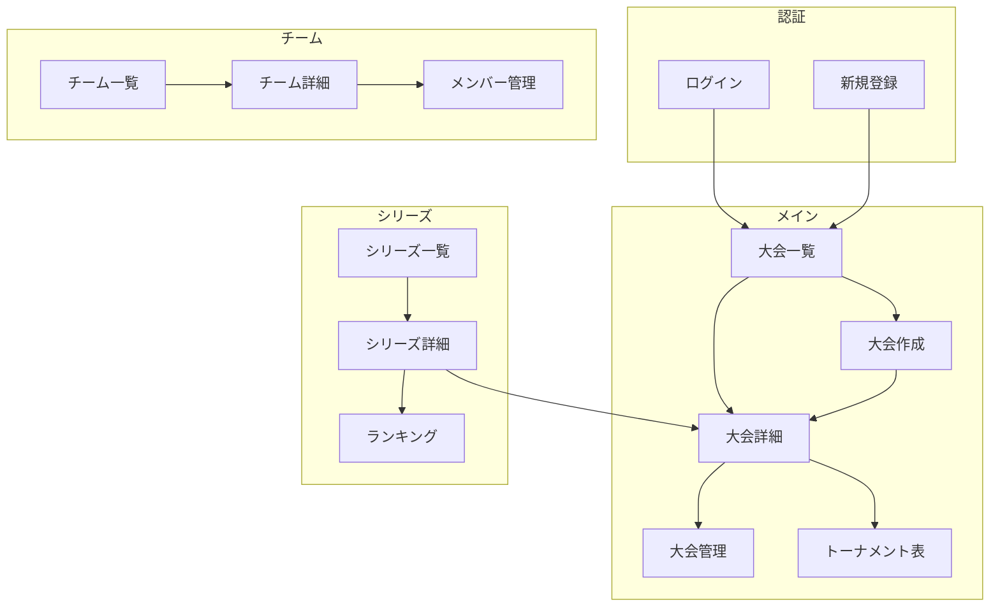

# 画面設計

## 目的

Katorin2の画面設計を定義する。本ドキュメントはUI設計のSSoTである。

## 背景

遊戯王マスターデュエルのオンライントーナメント運営に必要な画面を設計する。主催者・参加者双方の使いやすさを重視する。

## 画面一覧

### 共通・認証

| # | カテゴリ | 画面名 | URL | Phase |
|---|---------|--------|-----|-------|
| 1 | 共通 | ヘッダー/ナビゲーション | - | 1 |
| 2 | 認証 | ログイン | /login | 1 |
| 3 | 認証 | 新規登録 | /register | 1 |
| 4 | 認証 | パスワードリセット | /reset-password | 2 |

### 大会（単発）

| # | カテゴリ | 画面名 | URL | Phase |
|---|---------|--------|-----|-------|
| 5 | 大会 | 大会一覧 | /tournaments | 1 |
| 6 | 大会 | 大会詳細 | /tournaments/[id] | 1 |
| 7 | 大会 | 大会作成 | /tournaments/new | 1 |
| 8 | 大会 | 大会編集 | /tournaments/[id]/edit | 1 |
| 9 | 大会 | エントリーフォーム | /tournaments/[id]/entry | 1 |
| 10 | 大会 | 参加者一覧 | /tournaments/[id]/participants | 1 |
| 11 | 大会 | トーナメント表 | /tournaments/[id]/bracket | 1 |
| 12 | 大会 | 結果入力（主催者） | /tournaments/[id]/manage | 1 |
| 13 | 大会 | 結果報告（参加者） | /tournaments/[id]/report | 2 |

### シリーズ（長期大会）

| # | カテゴリ | 画面名 | URL | Phase |
|---|---------|--------|-----|-------|
| 14 | シリーズ | シリーズ一覧 | /series | 1 |
| 15 | シリーズ | シリーズ詳細 | /series/[id] | 1 |
| 16 | シリーズ | シリーズ作成 | /series/new | 1 |
| 17 | シリーズ | シリーズ編集 | /series/[id]/edit | 1 |
| 18 | シリーズ | ランキング | /series/[id]/ranking | 1 |

### チーム

| # | カテゴリ | 画面名 | URL | Phase |
|---|---------|--------|-----|-------|
| 19 | チーム | チーム一覧 | /teams | 1 |
| 20 | チーム | チーム詳細 | /teams/[id] | 1 |
| 21 | チーム | チーム作成 | /teams/new | 1 |
| 22 | チーム | チーム編集 | /teams/[id]/edit | 1 |
| 23 | チーム | メンバー管理 | /teams/[id]/members | 1 |
| 24 | チーム | 招待処理 | /teams/invite/[token] | 1 |

### ユーザー

| # | カテゴリ | 画面名 | URL | Phase |
|---|---------|--------|-----|-------|
| 25 | ユーザー | マイページ | /my | 1 |
| 26 | ユーザー | プロフィール編集 | /my/edit | 1 |
| 27 | ユーザー | 主催大会一覧 | /my/hosted | 1 |
| 28 | ユーザー | 参加大会一覧 | /my/joined | 1 |
| 29 | ユーザー | 所属チーム一覧 | /my/teams | 1 |

### 統計・分析

| # | カテゴリ | 画面名 | URL | Phase |
|---|---------|--------|-----|-------|
| 30 | 統計 | デッキマスタ管理 | /tournaments/[id]/decks | 1 |
| 31 | 統計 | 大会メタゲーム統計 | /tournaments/[id]/stats | 1 |
| 32 | 統計 | シリーズメタゲーム統計 | /series/[id]/stats | 1 |
| 33 | 統計 | チーム戦績詳細 | /teams/[id]/stats | 1 |

### SNS共有（画像生成）

| # | カテゴリ | 画面名 | URL | Phase |
|---|---------|--------|-----|-------|
| 34 | 共有 | 対戦カード生成 | /tournaments/[id]/share/match/[matchId] | 1 |
| 35 | 共有 | 結果カード生成 | /tournaments/[id]/share/result/[matchId] | 1 |
| 36 | 共有 | 大会結果サマリー | /tournaments/[id]/share/summary | 1 |
| 37 | 共有 | ラウンド対戦表 | /tournaments/[id]/share/round/[round] | 1 |
| 38 | 共有 | メタゲーム統計画像 | /tournaments/[id]/share/meta | 1 |
| 39 | 共有 | チーム戦績画像 | /teams/[id]/share/stats | 1 |

## 画面フロー

## 画面詳細

### ヘッダー/ナビゲーション（共通）

| 要素 | 説明 |
|------|------|
| ロゴ | Katorin → トップへリンク |
| ナビゲーション | 大会一覧 / シリーズ / チーム / マイページ |
| 未ログイン時 | ログイン / 新規登録ボタン |
| ログイン時 | ユーザー名 / ログアウト |

| 必要データ | 説明 |
|-----------|------|
| user_id | ログインユーザーID |
| display_name | 表示名 |
| avatar_url | アバター画像 |

### ログイン画面

| 要素 | 説明 |
|------|------|
| メールアドレス入力 | 必須 |
| パスワード入力 | 必須 |
| ログインボタン | フォーム送信 |
| 新規登録リンク | /register へ |
| パスワードを忘れた方リンク | /reset-password へ |
| Discordでログイン | Phase 2 |

### 新規登録画面

| 要素 | 説明 |
|------|------|
| メールアドレス入力 | 必須 |
| パスワード入力 | 必須 |
| パスワード確認入力 | 必須 |
| 表示名入力 | 必須 |
| 利用規約同意チェック | 必須 |
| 登録ボタン | フォーム送信 |

### 大会一覧画面

| 要素 | 説明 |
|------|------|
| 検索バー | キーワード検索 |
| フィルター | ステータス、形式、参加形式 |
| 大会カード | タイトル、ステータス、形式、参加者数、開催日時 |
| ページネーション | ページ送り |

| フィルター項目 | 選択肢 |
|---------------|--------|
| ステータス | 募集中 / 開催中 / 終了 |
| 形式 | シングルエリミ / ダブルエリミ / スイスドロー |
| 参加形式 | 個人戦 / チーム戦 |

### 大会詳細画面

| 要素 | 説明 |
|------|------|
| カバー画像 | 大会のカバー画像 |
| タイトル/ステータスバッジ | 大会名とステータス表示 |
| シリーズ情報 | 所属シリーズ（ある場合） |
| 説明文 | マークダウン対応 |
| 大会情報テーブル | 形式、参加人数、日時等 |
| 主催者情報 | 主催者名、アバター |
| アクションボタン | エントリー / 大会管理 |
| タブ | 概要 / 参加者一覧 / トーナメント表 |

| アクションボタン | 表示条件 |
|-----------------|---------|
| エントリーする | 個人戦、一般ユーザー |
| チームでエントリーする | チーム戦、チームリーダー |
| 大会を管理 | 主催者 |

### 大会作成画面

| セクション | 入力項目 |
|-----------|---------|
| 基本情報 | タイトル、説明、カバー画像、シリーズ選択 |
| 開催設定 | 開催日時、公開設定 |
| 参加形式 | 個人戦/チーム戦、チーム戦詳細設定 |
| エントリー設定 | 開始日時、締切日時、参加上限 |
| トーナメント設定 | 形式、対戦形式、チェックイン、結果報告方式 |

| チーム戦設定（チーム戦選択時） | 説明 |
|-----------------------------|------|
| チーム戦形式 | 勝ち抜き戦 / ポイント制 |
| チーム人数 | 最小〜最大人数 |
| チーム作成方式 | ユーザー自由 / 主催者指定 |

### トーナメント表画面

| 要素 | 説明 |
|------|------|
| ブラケット表示 | 形式に応じた表示 |
| リアルタイム更新 | 結果確定時に自動更新 |
| チーム戦詳細 | メンバー対戦結果の展開表示 |

| チーム戦表示 | 説明 |
|-------------|------|
| 勝ち抜き戦 | 各個人戦の勝敗 |
| ポイント制 | メンバーごとの勝敗とチーム合計 |

### 結果入力画面（主催者）

| 要素 | 説明 |
|------|------|
| 大会ステータス管理 | ステータス変更 |
| 対戦カード一覧 | 現在のラウンドの対戦 |
| 結果入力フォーム | スコア入力、勝者選択 |
| チーム戦対応 | 各メンバー戦の結果入力 |

### シリーズ一覧画面

| 要素 | 説明 |
|------|------|
| 検索バー | キーワード検索 |
| フィルター | ステータス、参加形式 |
| シリーズカード | タイトル、大会数、参加者数、期間 |

### シリーズ詳細画面

| 要素 | 説明 |
|------|------|
| ヘッダー情報 | タイトル、説明、期間 |
| ポイントルール | ポイント計算方式の説明 |
| タブ | 概要 / 大会一覧 / ランキング |
| アクションボタン | チーム登録（チーム戦の場合） |

### シリーズランキング画面

| 要素 | 説明 |
|------|------|
| ランキングテーブル | 順位、名前、ポイント、勝敗 |
| ポイント内訳 | 大会別ポイント（展開表示） |

### チーム一覧画面

| 要素 | 説明 |
|------|------|
| 検索バー | キーワード検索 |
| チームカード | チーム名、メンバー数、リーダー名 |
| 作成ボタン | チームを作成 |

### チーム詳細画面

| 要素 | 説明 |
|------|------|
| チーム情報 | 名前、アバター、説明、作成日 |
| メンバー一覧 | 名前、役割、加入日 |
| 参加中シリーズ/大会 | リスト表示 |
| 戦績サマリー | 勝敗、勝率 |

| アクションボタン | 表示条件 |
|-----------------|---------|
| チームを脱退 | メンバー |
| チームを編集 | リーダー |
| メンバー管理 | リーダー |

### メンバー管理画面

| 要素 | 説明 |
|------|------|
| メンバー一覧 | 役割変更、除外 |
| 招待機能 | 招待リンク生成、有効期限設定 |
| 招待中リスト | 招待取り消し |

### マイページ

| 要素 | 説明 |
|------|------|
| プロフィールサマリー | アバター、表示名 |
| 統計 | 参加大会数、主催大会数、所属チーム数 |
| クイックリンク | 参加中/主催中の大会、所属チーム |

### デッキマスタ管理画面

| 要素 | 説明 |
|------|------|
| デッキ一覧 | 名前、使用数、勝率 |
| デッキ追加 | 名前、アイコン、カテゴリ |
| 一括操作 | CSVインポート、テンプレート、コピー |

権限：主催者のみ編集可能

### メタゲーム統計画面

| 要素 | 説明 |
|------|------|
| サマリーカード | 総対戦数、ユニークデッキ数 |
| デッキ使用率チャート | 円グラフ/棒グラフ |
| デッキティア表 | Tier分類、使用率、勝率 |
| マッチアップ表 | デッキ相性マトリクス |
| フィルター | ラウンド範囲、日付範囲 |

### SNS共有画面（共通）

| 要素 | 説明 |
|------|------|
| プレビュー表示 | 生成される画像のプレビュー |
| カスタマイズ | テンプレート、背景色、表示項目 |
| 画像をダウンロード | PNG形式 |
| Twitterで共有 | 画像付きツイート |
| URLをコピー | OGP対応URL |

| 共有画像種別 | 用途 |
|-------------|------|
| 対戦カード | 試合前の対戦カード |
| 結果カード | 試合後の結果 |
| 大会サマリー | 大会終了後の結果まとめ |
| ラウンド対戦表 | 特定ラウンドの全対戦 |
| メタゲーム統計 | デッキ分布・勝率 |
| チーム戦績 | チームの戦績統計 |

画像仕様：1200x630px（OGP推奨サイズ）、PNG形式、サーバーサイドレンダリング

## OGP APIエンドポイント

| エンドポイント | 用途 |
|---------------|------|
| /api/og/match/[matchId] | 対戦カード画像 |
| /api/og/result/[matchId] | 結果カード画像 |
| /api/og/summary/[tournamentId] | 大会サマリー画像 |
| /api/og/round/[tournamentId]/[round] | ラウンド対戦表画像 |
| /api/og/meta/[tournamentId] | メタゲーム統計画像 |
| /api/og/team-stats/[teamId] | チーム戦績画像 |

## Realtime要件

| 対象 | 用途 |
|------|------|
| matches | 試合結果のリアルタイム更新 |
| individual_matches | チーム戦内対戦の更新 |
| participants | チェックイン状態の更新 |
| team_entries | チームエントリー状態の更新 |
| series_points | ランキング更新 |
| notifications | 通知配信 |

## 関連ドキュメント

- @01-introduction/tech-stack.md - 技術スタック
- @04-data/database-design.md - データベース設計
- @05-features/requirements.md - 機能要件
- @appendix/glossary.md - 用語集
