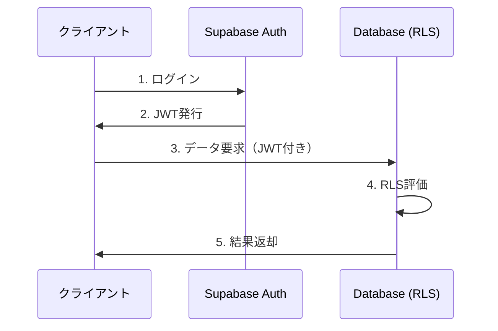

# Row Level Security (RLS) ポリシー

## 目的

Katorin2のRow Level Securityポリシー設計を定義する。本ドキュメントはアクセス制御のSSoTである。

## 背景

SupabaseのRow Level Securityを使用して、データベースレベルでアクセス制御を実装する。これにより、クライアントから直接データベースにアクセスする場合でも、適切な権限制御が保証される。

## 設計原則

| 原則 | 説明 |
|------|------|
| 最小権限の原則 | 必要最低限のアクセス権限のみ付与 |
| 認証必須 | 書き込み操作は認証済みユーザーのみ |
| 所有者優先 | リソースの所有者（主催者/リーダー）に管理権限 |
| 公開範囲制御 | visibility設定に基づくアクセス制御 |

## 認証状態

| 状態 | 説明 | 判定式 |
|------|------|--------|
| 認証済み | ログインユーザー | auth.uid() IS NOT NULL |
| 未認証 | 匿名ユーザー | auth.uid() IS NULL |
| 所有者 | リソースの作成者 | auth.uid() = organizer_id |

## テーブル別ポリシー

### profiles（ユーザープロフィール）

| 操作 | ポリシー | 条件 |
|------|----------|------|
| SELECT | 全員閲覧可 | なし |
| INSERT | 自分のプロフィールのみ | auth.uid() = id |
| UPDATE | 自分のプロフィールのみ | auth.uid() = id |

### tournaments（大会）

| 操作 | ポリシー | 条件 |
|------|----------|------|
| SELECT | 公開大会は全員、非公開は主催者のみ | visibility = 'public' OR organizer_id = auth.uid() |
| INSERT | 認証済みユーザー | auth.uid() IS NOT NULL |
| UPDATE | 主催者のみ | organizer_id = auth.uid() |
| DELETE | 主催者のみ | organizer_id = auth.uid() |

### participants（参加者）

| 操作 | ポリシー | 条件 |
|------|----------|------|
| SELECT | 公開大会は全員 | 大会のvisibilityに依存 |
| INSERT | 認証済みユーザー | 自分のエントリーのみ（user_id = auth.uid()） |
| UPDATE | 主催者のみ | 大会の主催者 |
| DELETE | 自分または主催者 | user_id = auth.uid() OR 大会の主催者 |

### matches（試合）

| 操作 | ポリシー | 条件 |
|------|----------|------|
| SELECT | 公開大会は全員 | 大会のvisibilityに依存 |
| INSERT | 主催者のみ | 大会の主催者 |
| UPDATE | 主催者のみ | 大会の主催者 |
| DELETE | 主催者のみ | 大会の主催者 |

### series（シリーズ）

| 操作 | ポリシー | 条件 |
|------|----------|------|
| SELECT | 全員閲覧可 | なし |
| INSERT | 認証済みユーザー | auth.uid() IS NOT NULL |
| UPDATE | 主催者のみ | organizer_id = auth.uid() |
| DELETE | 主催者のみ | organizer_id = auth.uid() |

### teams（チーム）

| 操作 | ポリシー | 条件 |
|------|----------|------|
| SELECT | 全員閲覧可 | なし |
| INSERT | 認証済みユーザー | auth.uid() IS NOT NULL |
| UPDATE | リーダーのみ | leader_id = auth.uid() |
| DELETE | リーダーのみ | leader_id = auth.uid() |

### team_members（チームメンバー）

| 操作 | ポリシー | 条件 |
|------|----------|------|
| SELECT | 全員閲覧可 | なし |
| INSERT | リーダーのみ | チームのリーダー |
| UPDATE | リーダーのみ | チームのリーダー |
| DELETE | 自分またはリーダー | user_id = auth.uid() OR チームのリーダー |

### team_invites（チーム招待）

| 操作 | ポリシー | 条件 |
|------|----------|------|
| SELECT | 全員閲覧可 | トークンによるアクセス |
| INSERT | リーダーのみ | チームのリーダー |
| DELETE | リーダーのみ | チームのリーダー |

### notifications（通知）

| 操作 | ポリシー | 条件 |
|------|----------|------|
| SELECT | 自分の通知のみ | user_id = auth.uid() |
| UPDATE | 自分の通知のみ | user_id = auth.uid() |
| INSERT | システムのみ | Service Role経由 |

### decks（デッキマスタ）

| 操作 | ポリシー | 条件 |
|------|----------|------|
| SELECT | 公開大会/シリーズは全員 | 親リソースの公開設定に依存 |
| INSERT | 主催者のみ | 大会/シリーズの主催者 |
| UPDATE | 主催者のみ | 大会/シリーズの主催者 |
| DELETE | 主催者のみ | 大会/シリーズの主催者 |

## キー管理

### Service Role Key

| 項目 | 説明 |
|------|------|
| 用途 | RLSをバイパスする必要があるサーバーサイド処理 |
| 使用例 | 通知の作成、システム処理、管理者操作 |
| 注意 | クライアントサイドでは絶対に使用しない |
| 保管場所 | 環境変数（SUPABASE_SERVICE_ROLE_KEY） |

### Anon Key

| 項目 | 説明 |
|------|------|
| 用途 | クライアントサイドからのアクセス |
| 特性 | RLSポリシーに従う |
| 保管場所 | 環境変数（NEXT_PUBLIC_SUPABASE_ANON_KEY） |

## 認証フロー

## トラブルシューティング

### よくある問題

| エラー | 原因 | 対処 |
|--------|------|------|
| new row violates row-level security policy | INSERT/UPDATE時にRLSポリシーに違反 | ポリシー条件を確認、認証状態を確認 |
| データが取得できない | SELECTポリシーで除外されている | visibility設定、認証状態を確認 |
| 通知が作成できない | Service Role Keyが必要 | サーバーサイドからService Roleで実行 |

### デバッグ方法

| 方法 | 説明 |
|------|------|
| 現在のユーザーID確認 | SQLで auth.uid() を確認 |
| ポリシー一時無効化 | 開発時のみ ALTER TABLE で DISABLE ROW LEVEL SECURITY |
| ログ確認 | Supabase Dashboardでログを確認 |

## 関連ドキュメント

- @04-data/database-design.md - データベース設計
- @08-deployment/oauth-setup.md - OAuth認証セットアップ
- @appendix/glossary.md - 用語集
