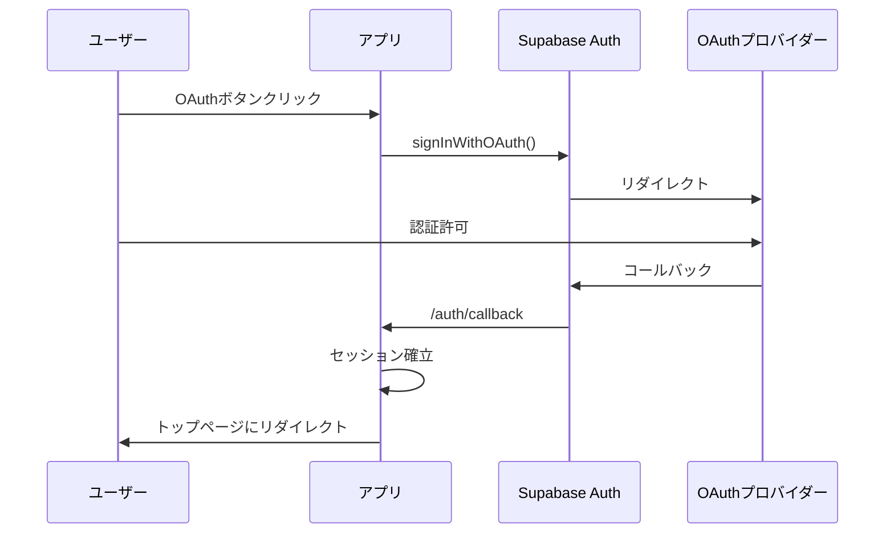

# OAuth認証セットアップガイド

## 目的

Katorin2のOAuth認証セットアップ手順を定義する。本ドキュメントは認証設定のSSoTである。

## 背景

メール/パスワード認証に加えて、Google・DiscordのOAuth認証をサポートする。Supabase Authを使用して実装している。

## 対応プロバイダー

| プロバイダー | 状態 | 用途 |
|-------------|------|------|
| Google | 対応済み | 一般ユーザー向け |
| Discord | 対応済み | ゲームコミュニティ向け |

## Google OAuth設定

### Google Cloud Console

| 手順 | 操作 |
|:----:|------|
| 1 | Google Cloud Consoleにアクセス |
| 2 | プロジェクトを作成または既存プロジェクトを選択 |
| 3 | 「APIとサービス」→「認証情報」に移動 |
| 4 | 「認証情報を作成」→「OAuthクライアントID」を選択 |
| 5 | 同意画面を設定（初回のみ） |
| 6 | OAuthクライアントIDを作成 |
| 7 | クライアントIDとクライアントシークレットをコピー |

### 同意画面設定

| 項目 | 値 |
|------|-----|
| ユーザータイプ | 外部 |
| アプリ名 | Katorin |
| サポートメール | 管理者のメールアドレス |

### OAuthクライアントID設定

| 項目 | 値 |
|------|-----|
| アプリケーションの種類 | ウェブアプリケーション |
| 名前 | Katorin（任意） |
| 承認済みのリダイレクトURI | https://[PROJECT_ID].supabase.co/auth/v1/callback |

### Supabase Dashboard設定

| 手順 | 操作 |
|:----:|------|
| 1 | Supabase Dashboardにアクセス |
| 2 | プロジェクトを選択 |
| 3 | 「Authentication」→「Providers」に移動 |
| 4 | 「Google」を選択 |
| 5 | 「Enable Sign in with Google」を有効化 |
| 6 | Client IDとClient Secretを入力 |
| 7 | 「Save」をクリック |

## Discord OAuth設定

### Discord Developer Portal

| 手順 | 操作 |
|:----:|------|
| 1 | Discord Developer Portalにアクセス |
| 2 | 「New Application」でアプリケーションを作成 |
| 3 | アプリケーション名を設定（Katorin） |
| 4 | 「OAuth2」セクションに移動 |
| 5 | 「Redirects」にリダイレクトURIを追加 |
| 6 | CLIENT IDとCLIENT SECRETをコピー |

### リダイレクトURI

| 環境 | URI |
|------|-----|
| 開発環境 | https://[PROJECT_ID].supabase.co/auth/v1/callback |
| 本番環境 | https://yourdomain.com/auth/callback |

### Supabase Dashboard設定

| 手順 | 操作 |
|:----:|------|
| 1 | Supabase Dashboardにアクセス |
| 2 | プロジェクトを選択 |
| 3 | 「Authentication」→「Providers」に移動 |
| 4 | 「Discord」を選択 |
| 5 | 「Enable Sign in with Discord」を有効化 |
| 6 | Client IDとClient Secretを入力 |
| 7 | 「Save」をクリック |

## 本番環境設定

### リダイレクトURIの追加

本番環境にデプロイ後、各OAuthプロバイダーに本番URLを追加する。

| プロバイダー | 設定場所 | 追加するURI |
|-------------|---------|-------------|
| Google | 認証情報 → OAuthクライアントID | https://yourdomain.com/auth/callback |
| Discord | OAuth2 → Redirects | https://yourdomain.com/auth/callback |

### Supabase URL設定

| 項目 | 設定値 |
|------|--------|
| Site URL | https://yourdomain.com |
| Redirect URLs | https://yourdomain.com/auth/callback |

設定場所：Supabase Dashboard →「Authentication」→「URL Configuration」

## 動作確認

### ローカル環境

| 手順 | 操作 |
|:----:|------|
| 1 | 開発サーバーを起動 |
| 2 | ログインページにアクセス |
| 3 | OAuth認証ボタンをクリック |
| 4 | プロバイダーの認証画面が表示されることを確認 |
| 5 | 認証後、リダイレクトされることを確認 |

### 本番環境

| 手順 | 操作 |
|:----:|------|
| 1 | 本番環境にデプロイ |
| 2 | ログインページにアクセス |
| 3 | OAuth認証が正常に動作することを確認 |

## トラブルシューティング

| エラー | 原因 | 対処 |
|--------|------|------|
| リダイレクトURIが一致しません | OAuth設定のリダイレクトURIが正しくない | プロバイダーとSupabaseの設定を確認 |
| Client ID or Secret is invalid | Client情報が間違っている | プロバイダーで再確認、必要に応じて再生成 |
| プロフィールが作成されない | データベーストリガーが動作していない | トリガー設定を確認 |
| ローカルでOAuthが動作しない | ローカル用リダイレクトURIが未設定 | localhost用のURIを追加 |

## セキュリティ上の注意点

| 項目 | 説明 |
|------|------|
| Client Secret | Supabase Dashboardに保存され、クライアント側には公開されない |
| HTTPS必須 | 本番環境では必ずHTTPSを使用 |
| CORS設定 | 本番ドメインがSupabaseで許可されていることを確認 |
| 環境分離 | 本番と開発で別のOAuthアプリケーションを使用することを推奨 |

## 認証フロー

## 関連ドキュメント

- @07-security/rls-policies.md - RLSポリシー設計
- @01-introduction/tech-stack.md - 技術スタック
- @appendix/glossary.md - 用語集

## 参考リンク

- Supabase Auth - Google OAuth
- Supabase Auth - Discord OAuth
- Google Cloud Console
- Discord Developer Portal
